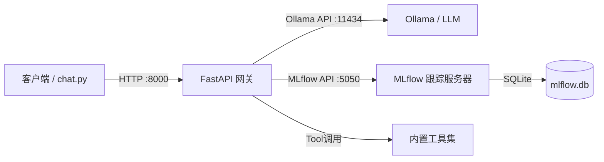

# Ollama MLflow Gateway 启动教程

本文档教你如何完整启动 [[ollama-mlflow-demo]] 项目的所有服务。

## 系统要求

- Python >= 3.13
- [uv](https://docs.astral.sh/uv/) 包管理器
- [Ollama](https://ollama.com/) 已安装并运行

## 项目架构



> [!info] 三个核心服务
> | 服务 | 端口 | 职责 |
> |------|------|------|
> | **Ollama** | `11434` | 本地 LLM 推理引擎 |
> | **MLflow** | `5050`  | 实验跟踪与 trace 记录 |
> | **Gateway** | `8000`  | OpenAI 兼容 API 代理 + 工具调用编排 |

## 第一步：安装依赖

```bash
uv sync                 # 安装项目依赖
uv sync --group dev     # （可选）安装开发依赖（pytest 等）
```

## 第二步：确认 Ollama 已运行

```bash
# 检查 Ollama 服务状态
curl http://127.0.0.1:11434/api/tags
```

> [!warning] 如果 Ollama 未启动
> 先启动 Ollama 应用，或在终端运行：
> ```bash
> ollama serve
> ```

确认目标模型已拉取：

```bash
ollama pull qwen3:8b    # 拉取 Qwen3 8B 模型（本项目默认）
```

## 第三步：启动 MLflow 跟踪服务器

```bash
uv run mlflow server \
  --host 127.0.0.1 \
  --port 5050 \
  --backend-store-uri sqlite:///mlflow.db \
  --default-artifact-root ./mlruns &
```

> [!tip] MLflow UI
> 启动后浏览器打开 http://127.0.0.1:5050 即可查看实验记录和 trace 详情。

## 第四步：启动 API 网关

```bash
uv run uvicorn gateway:app \
  --host 0.0.0.0 \
  --port 8000 \
  --reload &
```

> [!tip] `--reload` 模式下修改代码会自动重启，开发时很方便。

## 第五步：验证服务

```bash
# 1. 健康检查
curl http://127.0.0.1:8000/health

# 2. 列出可用模型（从 Ollama 同步）
curl http://127.0.0.1:8000/v1/models

# 3. 执行一个非流式聊天请求
curl -X POST http://127.0.0.1:8000/v1/chat/completions \
  -H "Content-Type: application/json" \
  -d '{
    "model": "qwen3:8b",
    "messages": [{"role": "user", "content": "你好，介绍一下自己"}]
  }'
```

> [!success] 预期结果
> 三个端点都返回正常 JSON 响应即为成功。

## 可选：使用交互式聊天

```bash
# 直连 Ollama（跳过网关）
uv run python chat.py --base-url http://127.0.0.1:11434/v1

# 通过网关（推荐 — 会自动记录 trace 到 MLflow）
uv run python chat.py

# 指定模型
uv run python chat.py --model qwen3:8b
```

## 公用命令

```
/exit        退出
/clear       清除对话历史
/help        显示帮助
```

## 环境变量参考

| 变量 | 默认值 | 说明 |
|------|--------|------|
| `MLFLOW_TRACKING_URI` | `http://127.0.0.1:5050` | MLflow 跟踪服务器地址 |
| `MLFLOW_EXPERIMENT` | `ollama-gateway-qwen3-8b` | MLflow 实验名称 |
| `OLLAMA_BASE_URL` | `http://127.0.0.1:11434/v1` | Ollama OpenAI 兼容 API 地址 |
| `MAX_CONCURRENT_OLLAMA` | `1` | 最大并发 LLM 请求数 |
| `RATE_LIMIT_ENABLED` | `false` | 是否启用速率限制 |
| `RATE_LIMIT_REQUESTS` | `60` | 速率窗口内最大请求数 |
| `RATE_LIMIT_WINDOW` | `60` | 速率限制时间窗口（秒） |

## 查看 MLflow Trace

网关的每次 LLM 调用会按以下结构记录到 MLflow：

```
MLflow Run
├── Parameters（模型名称、温度、工具数量等）
├── Metrics（延迟、工具循环轮次）
├── Artifacts
│   ├── request.json      ← 原始请求
│   ├── response.json     ← LLM 原始响应
│   ├── conversation.json ← 完整对话 + 工具调用日志
│   ├── answer.txt        ← 最终回答文本
│   └── reasoning.txt     ← 推理过程（如支持）
└── Spans（Trace）
    ├── chat_completion_request  ← 总请求 span
    │   ├── Completions (turn 1) ← 第 1 轮 LLM 调用
    │   ├── Completions (turn 2) ← 第 2 轮（如有工具调用）
    │   └── ...
```

> [!note]
> 要查看 Trace，在 MLflow UI 中打开对应 Run，点击 **Traces** 标签页。

## 常见问题

> [!question] 网关启动报错 "Address already in use"
> 端口被占用，修改端口或先停掉旧进程：
> ```bash
> lsof -i :8000 -i :5050
> kill -9 <PID>
> ```

> [!question] LLM 返回空内容或超时
> 确认 Ollama 正在运行且模型已拉取。测试直连：
> ```bash
> curl http://127.0.0.1:11434/api/generate \
>   -d '{"model":"qwen3:8b","prompt":"hi"}'
> ```

> [!question] MLflow 页面报 404
> 确保 `--backend-store-uri` 路径正确，且 `mlflow.db` 文件存在。

---

## 相关文档

- [[specs/features/gateway]] — 网关功能规格
- [[specs/features/tools]] — 工具系统规格
- [[specs/features/canvas]] — Canvas 功能规格
- [[specs/features/sessions]] — 会话管理规格

> [!info] 代码仓
> 项目路径：`/Users/yiyu/Desktop/Output/Pyleaf/ollama-mlflow-demo`
